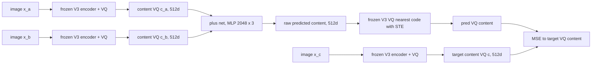
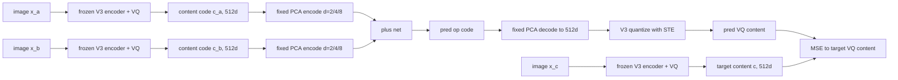
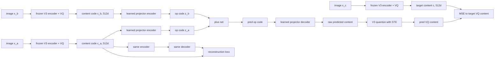
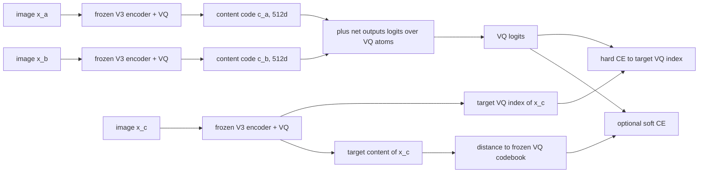
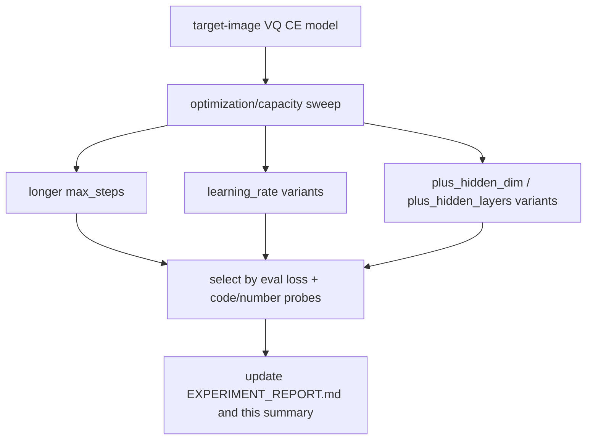

# V5 experiment summary

Last updated: 2026-06-22

## Goal

V5 aims to learn symbolic addition from perceptual uppercase-letter triplets without putting numeric or letter labels into the training loss.

Allowed training signal:

- observed perceptual triplet images `(x_a, x_b, x_c)`;
- frozen V3 content/VQ representations of those images;
- reconstruction or algebraic regularizers that do not use numeric/letter labels.

Disallowed training signal:

- numeric/letter labels as targets;
- majority-code-by-label targets;
- extra same-class positives selected by label.

Related docs:

- `evaluation.md`: how to read every metric and visualization.
- `EXPERIMENT_REPORT.md`: chronological experiment log and reflections.
- `operation_manual/README.md`: commands and config-switch notes.

## Current takeaways

- PCA bottlenecks with MSE+STE run cleanly but do not learn useful addition in short screening.
- Direct VQ-Plus is the S3Plus-style baseline: use V3 content VQ codes directly, run plus-net output through the same frozen V3 VQ with STE, then MSE to the observed target image's VQ content. With an explicit V5-side commit loss and a small train split, it can overfit train addition accuracy past 0.6, but eval/generalization remains poor.
- Learned projectors with a reconstruction anchor avoid collapse, but still do not solve addition under MSE+STE.
- Target-image VQ cross-entropy is the strongest label-free signal so far.
- Longer hard-CE training is still useful: the continuation run improved beyond 1000 steps and reached about 0.68 diagnostic number accuracy by step 5000.
- All current `label_free_*` best runs use `use_symmetry: false`.
- The strongest runs use `triplet_split_mode: all`, so eval measures held-out style/page transfer over the same arithmetic pair table, not unseen-pair algebraic generalization.
- Without symmetry constraints, train addition accuracy is especially important: a high eval score under `triplet_split_mode: all` should not be read as proof of learning ELPIS-style compositional generalization.

## Best runs by method

The table reports the best observed eval diagnostic number accuracy for each method family. `train add acc` is `train_number_accuracy`, a labelled diagnostic probe for addition correctness on the train split. These probes do not enter the training loss.

| method | symmetry | split | best run | step | train add acc | train code acc | eval number acc | eval code acc | eval loss | status |
| --- | --- | --- | --- | ---: | ---: | ---: | ---: | ---: | ---: | --- |
| Direct VQ-Plus + MSE+STE | no | all | `lf_direct_vq_plus_mse_ste_5000_20260622` | 5000 | 0.1169 | 0.1039 | 0.1039 | 0.1039 | 7.2470 | weak on full table |
| Direct VQ-Plus overfit screen | no | random 0.1 | `dvq_fixed_ratio01_h4096x4_c01_lr1e4_5000_20260623` | 3500 | 0.6957 | 0.9130 | 0.0288 | 0.0288 | 22.3687 | train target reached; no generalization |
| PCA d=2/4/8 + MSE+STE | no | all | `lf_pca_d2_mse_ste_200_20260621` | 200 | 0.0519 | 0.0519 | 0.0476 | 0.0476 | 7.9797 | weak signal |
| Learned projector + recon + MSE+STE | no | all | `lf_learned_d4_recon_mse_ste_200_20260621` | 100 | 0.0563 | 0.0563 | 0.0563 | 0.0519 | 8.2213 | recon works, addition weak |
| Target VQ CE, hard/soft | no | all | `lf_vq_ce_hard_resume5k_20260621` | 5000 | 0.7100 | 0.5974 | 0.6797 | 0.5628 | 1.0662 | strongest current branch |
| LR / longer / bigger plus-net sweeps | no | all | `lf_vq_ce_hard_lr3e5_from5k_to6k_20260622` | 5250 | 0.6883 | 0.6147 | 0.6580 | 0.5931 | 1.0019 | best exact-code accuracy so far |

Best loss note:

- For `lf_vq_ce_hard_resume5k_20260621`, best diagnostic number accuracy is step 5000: `0.6797`, with eval code acc `0.5628` and eval loss `1.0662`.
- Best exact code accuracy is `lf_vq_ce_hard_lr3e5_from5k_to6k_20260622` step 5250: `0.5931`, with eval number acc `0.6580` and eval loss `1.0019`.
- Lowest eval loss is `lf_vq_ce_hard_lr3e5_from5k_to6k_20260622` step 5500: `0.9819`, with eval number acc `0.6580` and eval code acc `0.5844`.
- For full-table Direct VQ-Plus, best eval number/code accuracy is step 5000: both `0.1039`. Lowest full-table Direct VQ-Plus eval loss is step 4500: `6.3030`, with eval number acc `0.0952` and eval code acc `0.0866`.
- For the small-split Direct VQ-Plus overfit screen, `train_ratio=0.1` and `4096 x 4` reached train number acc `0.6957` and train code acc `0.9130` at step 3500, but eval number/code acc stayed `0.0288`.
- Best loss, best exact-code accuracy, and best number accuracy no longer pick exactly the same checkpoint.

## Method 1: Direct VQ-Plus + MSE+STE

Config:

- `configs/label_free_direct_vq_plus_mse_ste.yaml`

Symmetry constraints:

- `use_symmetry: false`
- Current run uses `triplet_split_mode: all`.

Model diagram:

Interpretation:

- This is the closest V5 analogue of `S3Plus/VQ/train.py`: S3Plus `model.plus` returns continuous `z_plus` and quantized `e_plus`; this branch trains the quantized output against the target VQ content.
- It is label-free: the target VQ code comes from observed `x_c`, not from numeric/letter labels.
- It deliberately excludes symmetry, CE, PCA, and learned projectors.
- The 5000-step run suggests that direct MSE+STE can reduce distance to the target VQ content and slightly improve diagnostic accuracy, but it still has trouble reliably landing in the correct frozen V3 VQ basin.
- A bug/semantic mismatch was fixed on 2026-06-23: the V3 quantizer is kept in eval mode, so its library-provided commitment loss was zero. V5 now explicitly computes `MSE(raw_content, quantized_hard.detach())`, making `pred_commit_loss_weight` actually affect plus-net training.
- After that fix, small-train-split overfit is possible: with fixed V3 codes, `train_ratio=0.1`, `plus_hidden_dim=4096`, `plus_hidden_layers=4`, `pred_commit_loss_weight=0.1`, the train number probe reached `0.6957`.

## Method 2: PCA d=2/4/8 + MSE+STE

Configs:

- `configs/label_free_pca_d2_mse_ste.yaml`
- `configs/label_free_pca_d4_mse_ste.yaml`
- `configs/label_free_pca_d8_mse_ste.yaml`

Symmetry constraints:

- `use_symmetry: false`
- Current screening used `triplet_split_mode: all`.

Model diagram:

Interpretation:

- PCA is fixed and label-free.
- The weak point is optimization: MSE+STE has trouble landing on the correct V3 VQ basin.

## Method 3: learned projector + reconstruction anchor + MSE+STE

Configs:

- `configs/label_free_learned_d2_recon_mse_ste.yaml`
- `configs/label_free_learned_d4_recon_mse_ste.yaml`
- `configs/label_free_learned_d8_recon_mse_ste.yaml`

Symmetry constraints:

- `use_symmetry: false`
- Current screening used `triplet_split_mode: all`.

Model diagram:

Interpretation:

- The reconstruction anchor prevents the low-dimensional projector from collapsing.
- Current runs show reconstruction improves quickly, but addition accuracy remains near chance.

## Method 4: target-image VQ cross-entropy

Configs:

- `configs/label_free_vq_ce_hard.yaml`
- `configs/label_free_vq_ce_soft.yaml`

Symmetry constraints:

- `use_symmetry: false`
- Current best runs use `triplet_split_mode: all`.
- Therefore the strong eval accuracy should be read as style/page transfer over observed arithmetic pairs, not unseen-pair generalization.

Model diagram:

Interpretation:

- This is label-free because the target index comes from the observed target image `x_c`.
- Hard CE is currently stronger than soft CE.

## Method 5: LR / longer / bigger plus-net sweeps

Current branch:

- hard target-image VQ CE;
- `plus_hidden_dim: 2048`;
- `plus_hidden_layers: 3`;
- resume with optimizer state for longer sweeps.
- `use_symmetry: false`.

Big-net candidate:

- `configs/label_free_vq_ce_hard_big.yaml`
- `plus_hidden_dim: 4096`
- `plus_hidden_layers: 4`
- 1-step smoke `smoke_label_free_vq_ce_hard_big_check` passed on GPU.
- 2000-step screening `lf_vq_ce_hard_big_2000_20260622` peaked at eval number acc `0.6147` at step 1000, below the current best `0.6797`.
- The big net learns faster early, but the 2000-step screen did not beat the smaller long-run model.

Model diagram:

Interpretation:

- This method changes optimization and capacity rather than the label-free target definition.
- Because hard CE is still improving, longer training is the first sweep before changing LR or capacity.

## Update rule

Update this file whenever:

- a run sets a new best for a method family;
- a method is retired or promoted;
- the active best checkpoint changes;
- a new architecture/config family is added.
